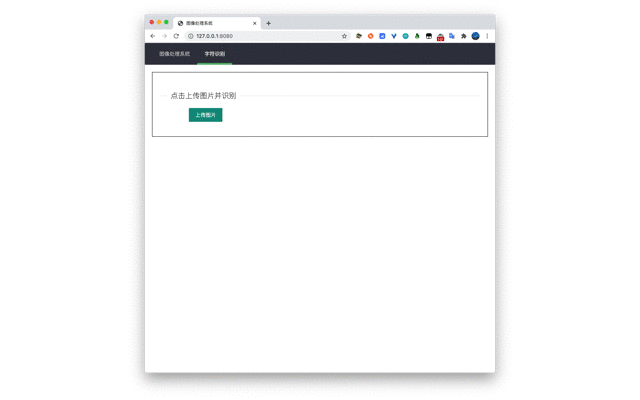

# 项目介绍

平时做了一些CV相关的小实验或者项目，都是按照命令行方式运行的，由于缺少一个UI页面，导致可视化是使用效果不佳。为此本项目制作了一个通用的web页面，用来实现可视化展示。



本web只有两个接口：
- 上传图片api
- 识别图片api （需要根据自己需求，实现`ocr.py`文件中的`def image_run` 方法）

# 使用说明

```bash
# 下载本仓库
git clone https://github.com/DLMU-312-AiLab/web-view-for-cv
cd web-view-for-cv

# 如果没有这三个目录需要创建
mkdir upload static templates

# 开启虚拟环境，如果不了解本步骤做什么，可以忽略
pip install virtualenv
virtualenv venv
source venv/bin/activate

# 安装Flask
pip install Flask

# 运行
python3 main.py x.x.x.x 8080
```

# 你需要做的

实现`ocr.py`的`image_run`方法，结果按照字符串的方式返回

# 技术栈

前人栽树，后人乘凉。得益与前人良好的框架，我们可以直接拿来使用，在此表示感谢。

- https://www.w3cschool.cn/flask
- https://www.layui.com

